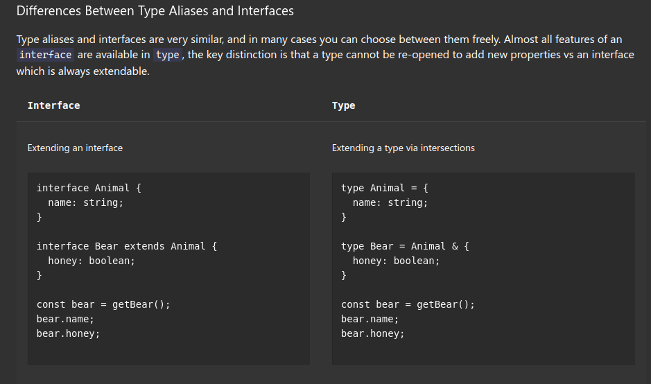

### some reasons to use type alias over interface

 

 #### let's start with the similarities:
 ```ts
// we can use both to describe an object
 type UserProps = {
      name: string;
      age: number;
      address: string;
 }

  interface UserProps {
        name: string;
        age: number;
        address: string;
  }

 // we use Intersections to combine types whereas we use extends to combine interfaces

  type UserProps = {
        name: string;
        age: number;
  }
  type AdminProps =UserProps & {
        role: string;
  }

  // we "extend" interfaces
  interface UserProps {
        name: string;
        age: number;
  }

  interface AdminProps extends UserProps {
        role: string;
  }


 ```


1. *interface* can only describe **object** type whereas *type aliases* can describe **object** AND **primitive** types (e.g. string, number, boolean, etc.)

   ```ts
   type AddressProps = string;
   const displayAddress = (address: Address) => console.log(address);
   ```

    ```ts
    interface AddressProps {
        address: string;
    }
    // we must use addressObject.address to access the value
    const displayAddress = (addressObject: AddressProps) => console.log(addressObject.address);
    ```
